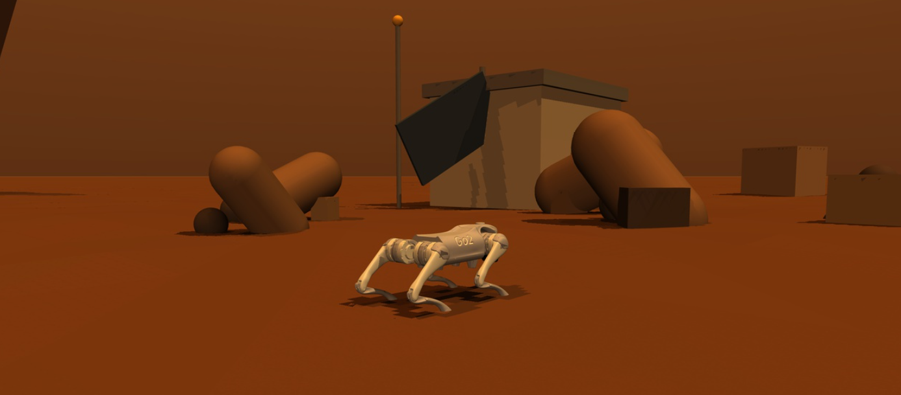

<p align="center">
  
</p>

<h1 align="center">🔴 Mars Prompt Arena</h1>

<p align="center">
  <strong>The global platform for mastering remote robot control through natural language.</strong><br/>
  Command a Unitree Go2 robot dog on Mars. Write prompts. Complete missions. Climb the leaderboard.
</p>

<p align="center">
  <a href="#-quickstart"></a>
  <a href="#-missions"></a>
  <a href="#-how-it-works"></a>
</p>

---

## 🌌 The Premise

> *Earth-Mars latency makes direct control impossible.*
> *You can't pilot the robot — you can only give it orders and wait.*
> *The game is in the prompt: vague orders fail, precise orders succeed.*

**Mars Prompt Arena** is a competitive training ground for finding the world's best remote robot operators. Players take on the role of **Mission Control on Earth**, sending natural-language commands to **CANIS-1** — an autonomous robot dog stranded on the Martian surface.

There's no joystick. No WASD. Just your words, an AI brain, and a ticking clock.

The robot runs on **[Gemini](https://deepmind.google/technologies/gemini/)** — it reads your prompts, plans its actions, executes them in a physics simulation, and reports back in first person like an astronaut on comms. Your job is to phrase commands that make it do the right thing.

---

## 🎮 Missions

Three progressively harder missions test different facets of prompt engineering:

### Mission 1 — Wake Up *(Tutorial)*

> The robot has just landed. Navigation system offline. Find the base and return before the batteries die.

- **Win condition:** Reach the base entrance
- **Budget:** 7 prompts
- **Teaches:** Basic robot communication — stand up, look around, navigate

### Mission 2 — Storm *(Urgency)*

> Sandstorm inbound. The camera is fogging up. Get to the shelter before visibility drops to zero.

- **Win condition:** Reach the shelter before the 2-minute timer expires
- **Budget:** 6 prompts
- **Teaches:** Prioritization under pressure, concise commands

### Mission 3 — Signal *(Mystery)*

> An anomalous signal from three unknown positions. Previous mission rovers went silent here. Find them.

- **Win condition:** Scan all 3 wreckage sites
- **Budget:** 8 prompts
- **Teaches:** Autonomous exploration, search strategies without known destinations

<details>
<summary>📊 Progression overview</summary>

| Mission   | Core Mechanic                  | What It Teaches                    |
|-----------|--------------------------------|------------------------------------|
| Wake Up   | Basic navigation               | How to communicate with the robot  |
| Storm     | Timer + degrading visibility   | Priority and urgency               |
| Signal    | Exploration without a map      | Autonomy and search                |

</details>

---

## ⚡ Quickstart

### Prerequisites

- **Python 3.11+**
- A **[Gemini API key](https://aistudio.google.com/apikey)** (free tier works)
- **EGL** support for headless MuJoCo rendering (most Linux systems with a GPU)

### 1. Clone & install

```bash
git clone https://github.com/your-username/mars-prompt-arena.git
cd mars-prompt-arena
python -m venv .venv && source .venv/bin/activate
pip install -r requirements.txt
```

### 2. Set your API key

```bash
echo "GEMINI_API_KEY=your-key-here" > .env
```

### 3. Launch

```bash
BRAIN_MODE=gemini SIM_MODE=mujoco MUJOCO_GL=egl python main.py
```

Then open **[http://localhost:8000](http://localhost:8000)** and start commanding your robot.

---

## 🧠 How It Works

<table>
<tr>
<td width="50%">

### The Agentic Loop

```
You type a prompt
    ↓
Mission checks budget
    ↓
Gemini sees: prompt + camera + state
    ↓
Gemini calls tools (walk, turn, scan…)
    ↓
MuJoCo executes actions
    ↓
Gemini narrates what happened
    ↓
UI updates with camera + narration
    ↓
Win condition checked → next prompt
```

</td>
<td width="50%">

### Robot Skills

| Skill            | Description                        |
|------------------|------------------------------------|
| `walk`           | Move in a direction                |
| `turn`           | Rotate in place                    |
| `sit`            | Sit down                           |
| `stand`          | Stand up                           |
| `scan`           | 360° area scan, discover targets   |
| `navigate_to`    | Move toward a known object         |
| `report`         | Summarize position and discoveries |

</td>
</tr>
</table>

The robot has **no autonomy by default**. It only does what Gemini tells it to do, and Gemini only acts on what *you* tell it. The quality of the outcome depends entirely on the quality of your prompts.

---

## 🏗 Architecture

```
mars-prompt-arena/
├── sim/              # Simulation layer (MuJoCo physics)
│   ├── mujoco_env.py # Full physics with Go2 MJCF model
│   └── scenes/       # MJCF scene files per mission
├── agent/            # AI brain layer
│   ├── brain.py      # Gemini API: planning + narration
│   ├── tools.py      # Tool definitions (robot capabilities)
│   └── dispatcher.py # Maps tool calls → sim actions
├── missions/         # Mission logic & win conditions
│   ├── wake_up.py    # Mission 1
│   ├── storm.py      # Mission 2 (timer + visibility)
│   └── signal.py     # Mission 3 (exploration + scan)
├── ui/               # FastAPI server + web frontend
│   ├── server.py     # WebSocket hub
│   └── static/       # HTML / CSS / JS
├── main.py           # Entry point
├── config.py         # All shared settings & data contracts
└── .env              # GEMINI_API_KEY
```

| Layer      | Technology                                         |
|------------|----------------------------------------------------|
| Simulation | MuJoCo + Unitree Go2 MJCF (mujoco-menagerie)      |
| AI Brain   | Gemini 3 Flash Preview (multimodal + function call) |
| Backend    | FastAPI + WebSocket                                 |
| Frontend   | Vanilla HTML / CSS / JS                             |
| Language   | Python 3.11+                                        |

---

## 🏆 Leaderboard

Every completed mission is scored and ranked. The leaderboard tracks:

- **Prompts used** — fewer is better
- **Time elapsed** — speed matters in Storm
- **Mission completion** — did you actually win?

Practice your prompt craft. Climb the rankings. Prove you're the best remote operator on the planet.

---

## 👥 Authors

- **Jacopo Dardini** — University of Bologna
- **Davide Benedetti Valentini** — University Roma Tre

Both authors had zero prior experience working with robotics and simulation environments.

---

## 📜 License

MIT

---

<p align="center">
  <sub>Built with 🤖 <a href="https://mujoco.org">MuJoCo</a> · 🧠 <a href="https://deepmind.google/technologies/gemini/">Gemini</a> · ❤️ Curiosity</sub>
</p>
